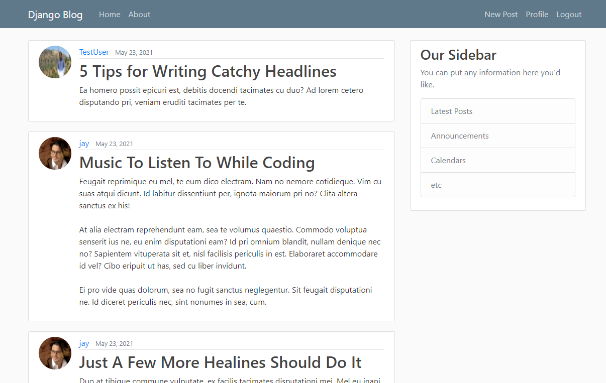
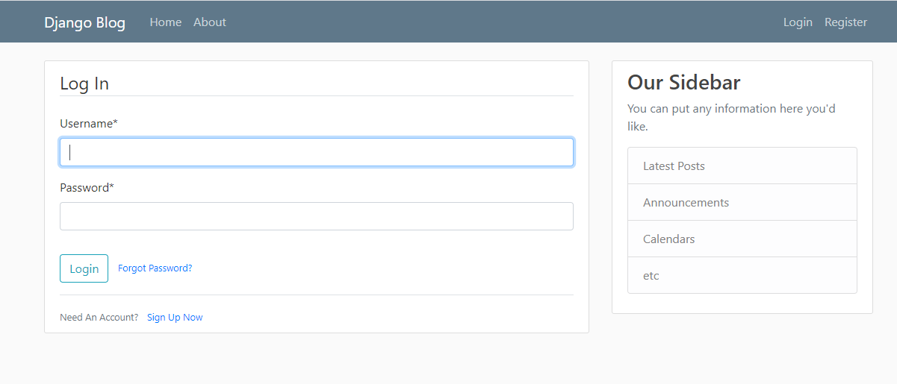
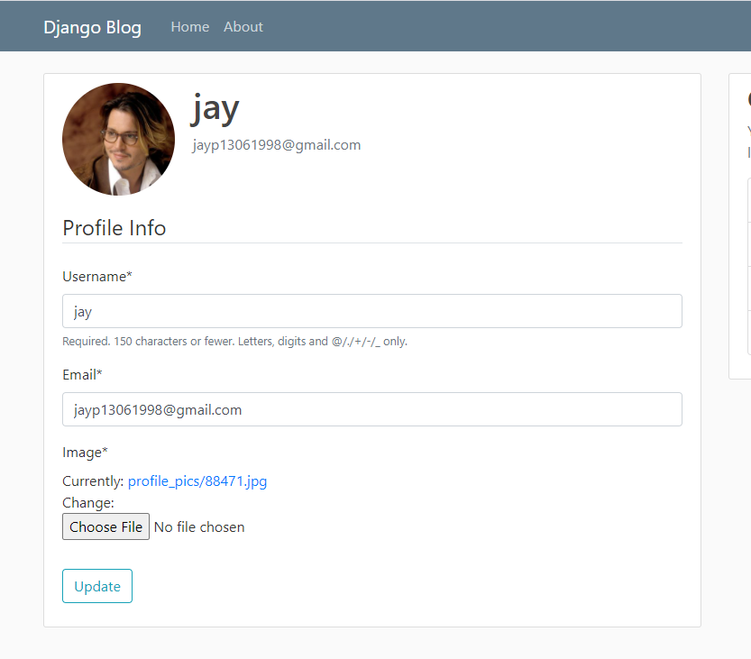
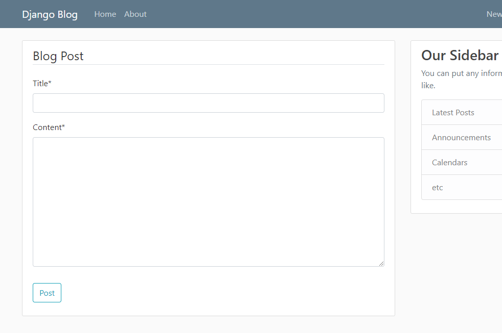
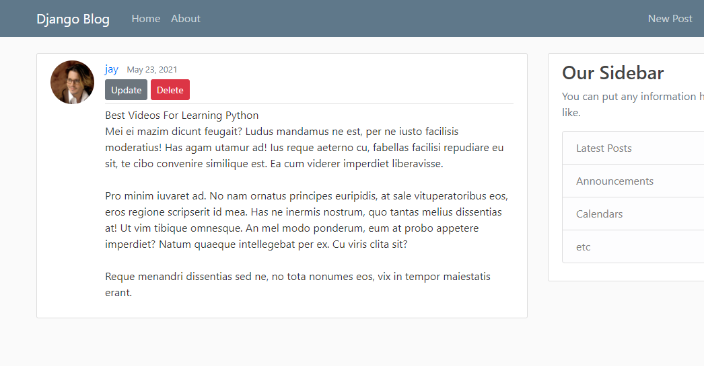
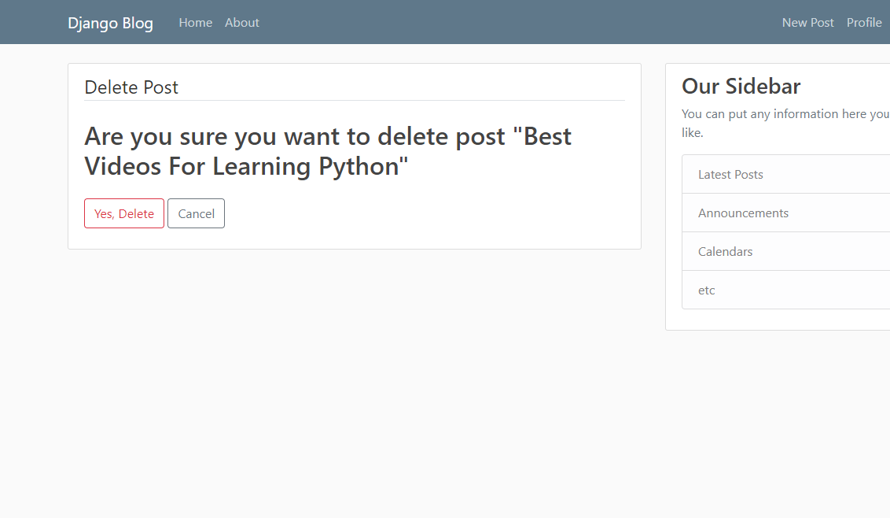

# Django Blog

Full-Featured Blog with Django web framework. 

Features 
=
- User Registration
- User Login & Logout
- User Profile
- Create, Update, Edit & Delete Posts
- Comments
- Search
- User Change Password
- Password Reset
- Customized admin panel

How To Use
=
## Clone project & Install Requirements
> Make sure you have already installed python3 and git.
```
$ git clone https://github.com/pubuser7/django-blog.git && cd django-blog
$ pip install -r requirements.txt
```
## Migrate & Collect Static
```
$ cd src && python manage.py migrate
$ python manage.py collectstatic
```
## Create Admin User
```
$ python manage.py createsuperuser
```
## Run Server
```
$ python manage.py runserver
```
> Enter your browser http://localhost:8000/. You can login via admin in http://localhost:8000/admin/.

## Add Some Fake Posts
> First add one another user from blog register page or admin panel.
```
$ python manage.py shell
>>> from blog.models import Post
>>> import json
>>> with open('posts.json') as f:
...     json_posts = json.load(f)
...
>>> for post in json_posts:
...     Post(title=post['title'], content=post['content'], author_id=post['user_id']).save()
...
>>> exit()
```
> You can edit posts via admin panel or from current user added post.

Screenshots
=







TODOS
=
- Change Style
- More Options For New Post
- Sidebar
- Reply comment
- Search for post any pages
- Create following system
- Read later post
- Like post
